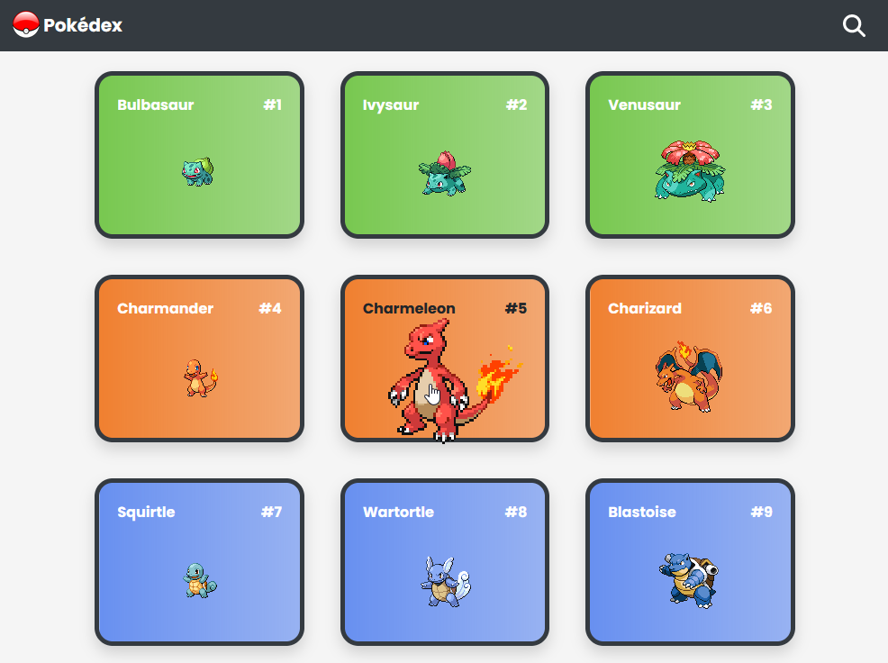

# Project description

A simple app using vanilla JavaScript, Bootstrap, and a tiiiiny bit of jQuery to search and display Pokédex entries.

It displays the classic 150 Pokémon, so that you can feel 10 years old again :)

# Screenshot

# How to run the app

Just open the `index.html` file in your browser.

Or just check out the [live version](https://jamkerr.github.io/pokedex-js-app/) to see how it looks in action.

# Dependencies and API

This app gets its Pokémon information from [PokéAPI version 2](https://pokeapi.co/docs/v2).

Other dependencies include Bootstrap 4.3.1 (including the slim version of jQuery version 3.3.1, and Popper 1.14.7).
